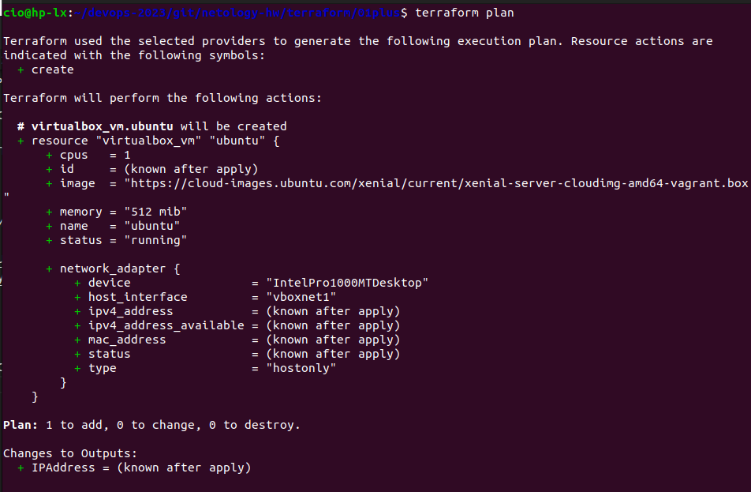

## Домашнее задание к занятию   «Введение в Terraform»
1) Скачайте и установите актуальную версию terraform >=1.4.0 . Приложите скриншот вывода команды terraform --version.
   

## Задача 2
2. Изучите файл .gitignore. 
   В каком terraform файле согласно этому .gitignore допустимо сохранить личную, секретную информацию?
   * personal.auto.tfvars
  
3. Выполните код проекта. Найдите в State-файле секретное содержимое созданного ресурса random_password, пришлите в качестве ответа конкретный ключ и его значение.
   
   * "result": "TQ9t2DRlZVn7DNGZ"
  
4. Раскомментируйте блок кода, примерно расположенный на строчках 29-42 файла main.
   tf. Выполните команду terraform validate. 
   
   Объясните в чем заключаются намеренно допущенные ошибки? Исправьте их.
   * строка 24 - для блока необходимо указать имя и тип, изначально указан только тип
   * строка 29 - имя начинается с цифры
   * строка 31 - блок описан с ошибкой random_string_fake

5. Выполните код. В качестве ответа приложите вывод команды docker ps
  

6. Замените имя docker-контейнера в блоке кода на hello_world, выполните команду terraform apply -auto-approve. 
Объясните своими словами, в чем может быть опасность применения ключа -auto-approve ? 

    * применение данного ключа отменяет интерактивный вывод внесенных изменений в файл плана, в том числе отменит подтверждение со стороны пользователя командой yes
    * В качестве ответа дополнительно приложите вывод команды docker ps
    
7. Уничтожьте созданные ресурсы с помощью terraform. Убедитесь, что все ресурсы удалены. Приложите содержимое файла terraform.tfstate.
   
8. Объясните, почему при этом не был удален docker образ nginx:latest ? Ответ подкрепите выдержкой из документации провайдера.
В коде есть команда, которая указывает на локальное хранение созданного образа.
keep_locally = true

Мне не удалось найти описание данного параметра в документации провайдера. 
Источники, в которых я нашел использование данной команды:
https://github.com/kreuzwerker/terraform-provider-docker/issues/27
https://developer.hashicorp.com/terraform/tutorials/cli/apply

## Задача 2*

Создайте с его помощью любую виртуальную машину.  
В качестве ответа приложите plan для создаваемого ресурса и скриншот созданного в VB ресурса.

<red> Машина была удачно создана с помощью данного кода, но после создания не может запуститься. В чем может быть причина?
Ошибка при включении ВМ следующая: </red>

