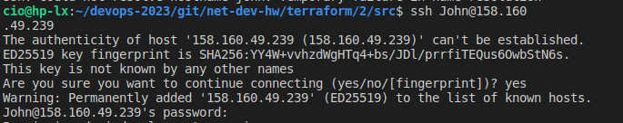

## Домашнее задание к занятию «Основы Terraform. Yandex Cloud»

## Задание 1
   
4. Инициализируйте проект, выполните код. Исправьте возникшую ошибку. Ответьте в чем заключается ее суть?

    Данная ошибка говорит о том, что данная платформа ВМ "standart-1" не поддерживает минимальное количество ядер CPU = 1. Т. е. значение <i>core</i> в файле <i>main</i> нужно увеличить до 2.

5. Ответьте, как в процессе обучения могут пригодиться параметры preemptible = true.
   
   * <i>С помощью данного параметра можно создать "Выгружаемую" ВМ, которая является менее отказоустойчивой, но имеет меньшую цену обслуживания и может быть остановлена в любое время, например при истечении 24 часов или недостаточном количестве ресурсов для ее работы.</i>

     core_fraction=5 в параметрах ВМ? Ответ в документации Yandex cloud.

   * <i>При создании каждой виртуальной машины необходимо выбирать уровень производительности vCPU. Этот уровень определяет долю вычислительного времени физических ядер, которую гарантирует vCPU. ВМ с уровнем производительности меньше 100% предназначены для запуска приложений, не требующих высокой производительности и не чувствительных к задержкам. Такие машины обойдутся дешевле.</i>

В качестве решения приложите:

* скриншот ЛК Yandex Cloud с созданной ВМ,
  

* скриншот успешного подключения к консоли ВМ через ssh,
  
* ответы на вопросы - **в начале файла**

## Задание 2
1. Изучите файлы проекта.

2. Замените все "хардкод" значения для ресурсов yandex_compute_image и yandex_compute_instance на отдельные переменные. К названиям переменных ВМ добавьте в начало префикс vm_web_ . Пример: vm_web_name.

3. Объявите нужные переменные в файле variables.tf, обязательно указывайте тип переменной. Заполните их default прежними значениями из main.tf.

4. Проверьте terraform plan (изменений быть не должно).

## Задание 3
1. Создайте в корне проекта файл 'vms_platform.tf' . Перенесите в него все переменные первой ВМ.
2. Скопируйте блок ресурса и создайте с его помощью вторую ВМ(в файле main.tf): "netology-develop-platform-db" , cores = 2, memory = 2, core_fraction = 20. 
Объявите ее переменные с префиксом vm_db_ в том же файле('vms_platform.tf').
3. Примените изменения.

## Задание 4
   1. Объявите в файле outputs.tf output типа map, содержащий { instance_name = external_ip } для каждой из ВМ.
   2. Примените изменения.

В качестве решения приложите вывод значений ip-адресов команды terraform output:

## Задание 5
1. В файле locals.tf опишите в одном local-блоке имя каждой ВМ, используйте интерполяцию ${..} с несколькими переменными по примеру из лекции.
2. Замените переменные с именами ВМ из файла variables.tf на созданные вами local переменные.
3. Примените изменения.

## Задание 6
1. Вместо использования 3-х переменных ".._cores",".._memory",".._core_fraction" в блоке resources {...}, объедените их в переменные типа map с именами "vm_web_resources" и "vm_db_resources".
2. Так же поступите с блоком metadata {serial-port-enable, ssh-keys}, эта переменная должна быть общая для всех ваших ВМ.
3. Найдите и удалите все более не используемые переменные проекта.
4. Проверьте terraform plan (изменений быть не должно).