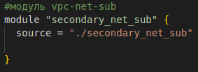
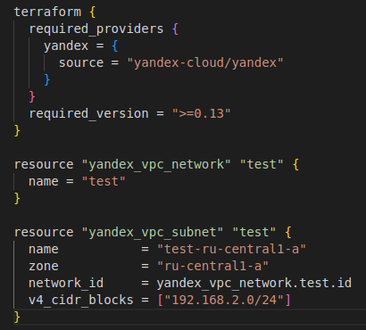

## Домашнее задание к занятию "Продвинутые методы работы с Terraform"

## Задание 1
1. Возьмите из демонстрации к лекции готовый код для создания ВМ с помощью remote модуля.
2. Создайте 1 ВМ, используя данный модуль. В файле cloud-init.yml необходимо использовать переменную для ssh ключа вместо хардкода. Передайте ssh-ключ в функцию template_file в блоке vars ={} .
   
   
   
   Воспользуйтесь примером. Обратите внимание что ssh-authorized-keys принимает в себя список, а не строку!

   
3. Добавьте в файл cloud-init.yml установку nginx.
4. Предоставьте скриншот подключения к консоли 
    
    
    и вывод команды sudo nginx -t.

    
## Задание 2

1. Напишите локальный модуль vpc, который будет создавать 2 ресурса: одну сеть и одну подсеть в зоне, объявленной при вызове модуля. например: ru-central1-a.
   
   

  * Файл main.tf модуля
  
   

2. Модуль должен возвращать значения vpc.id и subnet.
   
   
3. Замените ресурсы yandex_vpc_network и yandex_vpc_subnet, созданным модулем.
   
   
4. Сгенерируйте документацию к модулю с помощью terraform-docs.
   