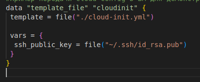
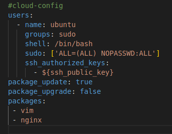
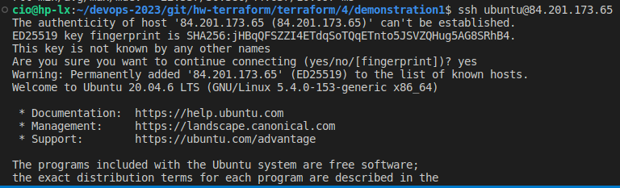
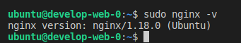
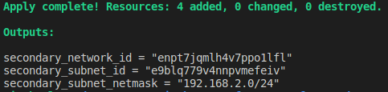
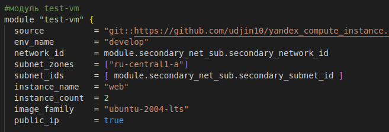

## Домашнее задание к занятию "Продвинутые методы работы с Terraform"

## Задание 1
1. Возьмите из демонстрации к лекции готовый код для создания ВМ с помощью remote модуля.
2. Создайте 1 ВМ, используя данный модуль. В файле cloud-init.yml необходимо использовать переменную для ssh ключа вместо хардкода. Передайте ssh-ключ в функцию template_file в блоке vars ={} .
   
   
   
   Воспользуйтесь примером. Обратите внимание что ssh-authorized-keys принимает в себя список, а не строку!

   
3. Добавьте в файл cloud-init.yml установку nginx.
4. Предоставьте скриншот подключения к консоли 
    
    
    и вывод команды sudo nginx -t.

    
## Задание 2

1. Напишите [локальный](https://github.com/VladimirKru/hw-terraform/tree/main/terraform/4/demonstration1/secondary_net_sub) модуль vpc, который будет создавать 2 ресурса: одну сеть и одну подсеть в зоне, объявленной при вызове модуля. например: ru-central1-a.

2. Модуль должен возвращать значения vpc.id и subnet.
   
   
3. Замените ресурсы yandex_vpc_network и yandex_vpc_subnet, созданным модулем.
   
   
4. Сгенерируйте [документацию](https://github.com/VladimirKru/hw-terraform/blob/main/terraform/4/demonstration1/docs.md) к модулю с помощью terraform-docs.
   
## Задание 3

1. Выведите список ресурсов в стейте.
2. Полностью удалите из стейта модуль vpc.
3. Импортируйте все обратно. Проверьте terraform plan - изменений быть не должно. Приложите список выполненных команд и скриншоты процессы.
```markdown
cio@hp-lx:~/devops-2023/git/hw-terraform/terraform/4/demonstration1$ terraform state list
data.template_file.cloudinit
module.secondary_net_sub.yandex_vpc_network.test
module.secondary_net_sub.yandex_vpc_subnet.test
module.test-vm.data.yandex_compute_image.my_image
module.test-vm.yandex_compute_instance.vm[0]
module.test-vm.yandex_compute_instance.vm[1]
cio@hp-lx:~/devops-2023/git/hw-terraform/terraform/4/demonstration1$ terraform state show module.secondary_net_sub.yandex_vpc_subnet.test
# module.secondary_net_sub.yandex_vpc_subnet.test:
resource "yandex_vpc_subnet" "test" {
    created_at     = "2023-07-13T21:41:48Z"
    folder_id      = "b1gq43cobb08cuhvbs1v"
    id             = "e9b9e7hq8n08ch5eh0a8"
    labels         = {}
    name           = "test-ru-central1-a"
    network_id     = "enp8eqq0figtj96ro9qn"
    v4_cidr_blocks = [
        "192.168.2.0/24",
    ]
    v6_cidr_blocks = []
    zone           = "ru-central1-a"
}
cio@hp-lx:~/devops-2023/git/hw-terraform/terraform/4/demonstration1$ terraform state rm  module.secondary_net_sub.yandex_vpc_subnet.test
Removed module.secondary_net_sub.yandex_vpc_subnet.test
Successfully removed 1 resource instance(s).
cio@hp-lx:~/devops-2023/git/hw-terraform/terraform/4/demonstration1$ terraform import  module.secondary_net_sub.yandex_vpc_subnet.test e9b9e7hq8n08ch5eh0a8
╷
│ Warning: Version constraints inside provider configuration blocks are deprecated
│ 
│   on .terraform/modules/test-vm/providers.tf line 2, in provider "template":
│    2:   version = "2.2.0"
│ 
│ Terraform 0.13 and earlier allowed provider version constraints inside the
│ provider configuration block, but that is now deprecated and will be
│ removed in a future version of Terraform. To silence this warning, move the
│ provider version constraint into the required_providers block.
╵

data.template_file.cloudinit: Reading...
data.template_file.cloudinit: Read complete after 0s [id=eb2117f32966e2b056f212bca8851d5902894ee9cc53a1a042e65fcc7e114478]
module.test-vm.data.yandex_compute_image.my_image: Reading...
module.secondary_net_sub.yandex_vpc_subnet.test: Importing from ID "e9b9e7hq8n08ch5eh0a8"...
module.secondary_net_sub.yandex_vpc_subnet.test: Import prepared!
  Prepared yandex_vpc_subnet for import
module.secondary_net_sub.yandex_vpc_subnet.test: Refreshing state... [id=e9b9e7hq8n08ch5eh0a8]
module.test-vm.data.yandex_compute_image.my_image: Read complete after 1s [id=fd85f37uh98ldl1omk30]

Import successful!

The resources that were imported are shown above. These resources are now in
your Terraform state and will henceforth be managed by Terraform.

╷
│ Warning: Version constraints inside provider configuration blocks are deprecated
│ 
│   on .terraform/modules/test-vm/providers.tf line 2, in provider "template":
│    2:   version = "2.2.0"
│ 
│ Terraform 0.13 and earlier allowed provider version constraints inside the
│ provider configuration block, but that is now deprecated and will be
│ removed in a future version of Terraform. To silence this warning, move the
│ provider version constraint into the required_providers block.
│ 
│ (and one more similar warning elsewhere)
╵

cio@hp-lx:~/devops-2023/git/hw-terraform/terraform/4/demonstration1$ terraform plan
data.template_file.cloudinit: Reading...
data.template_file.cloudinit: Read complete after 0s [id=eb2117f32966e2b056f212bca8851d5902894ee9cc53a1a042e65fcc7e114478]
module.test-vm.data.yandex_compute_image.my_image: Reading...
module.secondary_net_sub.yandex_vpc_network.test: Refreshing state... [id=enp8eqq0figtj96ro9qn]
module.test-vm.data.yandex_compute_image.my_image: Read complete after 0s [id=fd85f37uh98ldl1omk30]
module.secondary_net_sub.yandex_vpc_subnet.test: Refreshing state... [id=e9b9e7hq8n08ch5eh0a8]
module.test-vm.yandex_compute_instance.vm[0]: Refreshing state... [id=fhmcublme8i41d6vj1km]
module.test-vm.yandex_compute_instance.vm[1]: Refreshing state... [id=fhmrd67aohgoff80i44e]

No changes. Your infrastructure matches the configuration.

Terraform has compared your real infrastructure against your configuration
and found no differences, so no changes are needed.
```