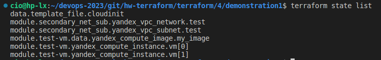

## Домашнее задание к занятию "Продвинутые методы работы с Terraform"

## Задание 1
1. Возьмите из демонстрации к лекции готовый код для создания ВМ с помощью remote модуля.
2. Создайте 1 ВМ, используя данный модуль. В файле cloud-init.yml необходимо использовать переменную для ssh ключа вместо хардкода. Передайте ssh-ключ в функцию template_file в блоке vars ={} .
   
   
   
   Воспользуйтесь примером. Обратите внимание что ssh-authorized-keys принимает в себя список, а не строку!

   
3. Добавьте в файл cloud-init.yml установку nginx.
4. Предоставьте скриншот подключения к консоли 
    
    
    и вывод команды sudo nginx -t.

    
## Задание 2

1. Напишите [локальный](https://github.com/VladimirKru/hw-terraform/tree/main/terraform/4/demonstration1/secondary_net_sub) модуль vpc, который будет создавать 2 ресурса: одну сеть и одну подсеть в зоне, объявленной при вызове модуля. например: ru-central1-a.

2. Модуль должен возвращать значения vpc.id и subnet.
   
   
3. Замените ресурсы yandex_vpc_network и yandex_vpc_subnet, созданным модулем.
   
   
4. Сгенерируйте [документацию](https://github.com/VladimirKru/hw-terraform/blob/main/terraform/4/demonstration1/docs.md) к модулю с помощью terraform-docs.
   
## Задание 3

1. Выведите список ресурсов в стейте.
   
2. Полностью удалите из стейта модуль vpc.
3. Полностью удалите из стейта модуль vm.
   ```markdown
    cio@hp-lx:~/devops-2023/git/hw-terraform/terraform/4/demonstration1$ terraform state rm 'module.secondary_net_sub.yandex_vpc_subnet.test' 
    Removed module.secondary_net_sub.yandex_vpc_subnet.test
    Successfully removed 1 resource instance(s).
    cio@hp-lx:~/devops-2023/git/hw-terraform/terraform/4/demonstration1$ terraform state rm 'module.test-vm.yandex_compute_instance.vm[0]'
    Removed module.test-vm.yandex_compute_instance.vm[0]
    Successfully removed 1 resource instance(s).
    cio@hp-lx:~/devops-2023/git/hw-terraform/terraform/4/demonstration1$ terraform state rm 'module.test-vm.yandex_compute_instance.vm[1]'
    Removed module.test-vm.yandex_compute_instance.vm[1]
    Successfully removed 1 resource instance(s).
   ```
4. Импортируйте все обратно. Проверьте terraform plan - изменений быть не должно. Приложите список выполненных команд и скриншоты процессы.
   ```markdown
   cio@hp-lx:~/devops-2023/git/hw-terraform/terraform/4/demonstration1$ terraform plan
    data.template_file.cloudinit: Reading...
    data.template_file.cloudinit: Read complete after 0s [id=eb2117f32966e2b056f212bca8851d5902894ee9cc53a1a042e65fcc7e114478]
    module.test-vm.data.yandex_compute_image.my_image: Reading...
    module.secondary_net_sub.yandex_vpc_network.test: Refreshing state... [id=enp590epdq5mb6nlfs3t]
    module.test-vm.data.yandex_compute_image.my_image: Read complete after 0s [id=fd85f37uh98ldl1omk30]
    module.secondary_net_sub.yandex_vpc_subnet.test: Refreshing state... [id=e9bjdu44v9ifcg4d3lmi]
    module.test-vm.yandex_compute_instance.vm[1]: Refreshing state... [id=fhma7ph4lkve9tfiup7e]
    module.test-vm.yandex_compute_instance.vm[0]: Refreshing state... [id=fhmg2nmotitr2je06f77]

    Terraform used the selected providers to generate the following execution
    plan. Resource actions are indicated with the following symbols:
    ~ update in-place

    Terraform will perform the following actions:

    # module.test-vm.yandex_compute_instance.vm[0] will be updated in-place
    ~ resource "yandex_compute_instance" "vm" {
        + allow_stopping_for_update = true
            id                        = "fhmg2nmotitr2je06f77"
            name                      = "develop-web-0"
            # (11 unchanged attributes hidden)

        - timeouts {}

            # (6 unchanged blocks hidden)
        }

    # module.test-vm.yandex_compute_instance.vm[1] will be updated in-place
    ~ resource "yandex_compute_instance" "vm" {
        + allow_stopping_for_update = true
            id                        = "fhma7ph4lkve9tfiup7e"
            name                      = "develop-web-1"
            # (11 unchanged attributes hidden)

        - timeouts {}

            # (6 unchanged blocks hidden)
        }

    Plan: 0 to add, 2 to change, 0 to destroy.
   ```